 

  

🌍 Pretoria, South Africa &nbsp;·&nbsp; 🟢 Open to Work &nbsp;·&nbsp; ⚡ Data + ML Systems Builder

  

---

## Who I Am

I fell in love with data through **SQL** — the feeling of writing a query that actually *answers* something hooked me early. That obsession grew into cloud engineering, machine learning, and building full products that surface data in ways real people use.

I'm competitive by nature. I don't believe in being disadvantaged by what I wasn't taught — if I don't know something, that's on me to fix. I surround myself with people who are sharper than me, learn fast, and keep raising my own bar.

> *Production-ready data pipelines on AWS. ML where it drives real value. Databases that don't break at scale.*

---

## Live Project

> ### **[GameSync Network →](https://gamesync-network.vercel.app/)**
>
> A competitive gaming platform built for South African arcades.
>
> **Stack:** Next.js · TypeScript · Supabase (PostgreSQL) · Vercel  
> **Features:** Full auth · Tournament registration · Real-time data · Multi-arcade infrastructure
>
> *This isn't just a project — it's a business I'm building. Data infrastructure for competitive gaming in SA.*

---

## Data Pipeline

  

---

## What I'm Building Right Now

| Project | Stack | Status |
|---------|-------|--------|
| **Applied AI Portfolio** | Python · TensorFlow · scikit-learn | 🔄 10 models |
| **GameSync Network** | Next.js · Supabase · TypeScript | 🟢 Live |
| **CryptoLens** | AWS · Prophet · Redshift | 🔄 In Progress |
| **sql-in-100-days** | T-SQL · SSMS · SQL Server | 🔄 Active |

*Full write-ups: [morobangtshigidimisa.vercel.app](https://morobangtshigidimisa.vercel.app)*

---

## Tech Stack

### ☁️ Data Engineering
`AWS` `Spark` `Kafka` `dbt` `Databricks` `n8n` `Glue` `Lambda` `Redshift`

### 🤖 Machine Learning
`Python` `scikit-learn` `TensorFlow` `PyTorch` `Pandas` `NumPy` `Prophet`

### 🗄️ Databases
`PostgreSQL` `MySQL` `SQL Server` `Supabase` `MongoDB` `Redis`

### 📊 Analytics
`Power BI` `Tableau` `Jupyter` `Matplotlib` `Seaborn`

### 🌐 Full-Stack
`Next.js` `TypeScript` `React` `Flask` `Streamlit` `Git`

---

## 📈 Proficiency

| Skill | Level | Progress |
|-------|-------|----------|
| **SQL & Database Design** | Advanced |  |
| **Python & Data Analysis** | Strong |  |
| **AWS Data Engineering** | Strong |  |
| **Power BI / BI Tools** | Proficient |  |
| **Machine Learning** | Growing |  |
| **Next.js / TypeScript** | Solid |  |

---

## 📜 Certifications

<table>
  <tr>
    <td align="center" width="250">
       
      
       
      
       
      ✅ Earned 2024
        
    </td>
    <td align="center" width="250">
       
      
       
      
       
      ✅ Earned 2024
        
    </td>
    <td align="center" width="250">
       
      
       
      
       
      ✅ Completed 2024
        
    </td>
  </tr>
</table>

---

## GitHub Analytics

  
  

  

  

---

## Contribution Snake

<picture>
  <source media="(prefers-color-scheme: dark)" srcset="https://raw.githubusercontent.com/Morobang/Morobang/output/github-snake-dark.svg" />
  <source media="(prefers-color-scheme: light)" srcset="https://raw.githubusercontent.com/Morobang/Morobang/output/github-snake.svg" />
  
</picture>

---

**Open to data engineering, ML engineering, and analyst roles**

 

 

