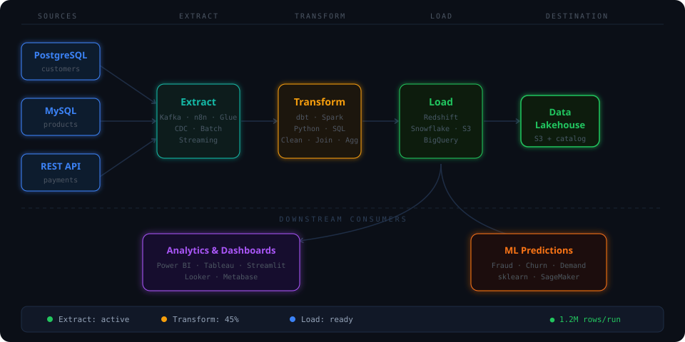

 

  

📍 Pretoria, South Africa &nbsp;·&nbsp; Data Engineer & Data Scientist &nbsp;·&nbsp; AWS Certified ×2 &nbsp;·&nbsp; 🟢 Open to Opportunities

  

---

## Who I Am

I fell in love with data through mathematics — the moment I realised that the right query,
like the right equation, can cut through noise and actually *answers* something.

That foundation led me through an Honours in Computer Science and a BSc in Mathematical
Science at the University of Limpopo, into cloud engineering, machine learning, and
production data systems.

I hold two AWS certifications (Cloud Practitioner + Data Engineer – Associate) and five AWS
Partner credentials. My work spans the full data stack: cloud-based ETL pipelines, fraud
detection and risk scoring systems using XGBoost and LightGBM, document intelligence
pipelines using Azure AI, predictive depreciation models, and full-stack applications
serving real users.

I'm based in Pretoria, South Africa, actively looking for a Data Engineer or Data Scientist
role. I don't wait to be taught — if there's a gap between where I am and where I need to
be, that's a schedule, not an excuse.

> *Production-ready pipelines. ML where it drives real value. Systems built to last.*

---

## Projects

All my projects — with live demos, source code, technical write-ups, and my 100-day
Python and SQL learning tracks — are on my portfolio:

**[morobangtshigidimisa.vercel.app →](https://morobangtshigidimisa.vercel.app)**

---

## ETL Pipeline Architecture

  
   
  Live animated pipeline — built with pure SVG · reflects actual AWS stack in use

---

## Tech Stack

### ☁️ Data Engineering & Cloud
`AWS S3` `AWS Glue` `AWS Redshift` `AWS Lambda` `Step Functions` `Azure AI` `n8n` `ETL Pipelines` `dbt`

### 🤖 Machine Learning
`Python` `scikit-learn` `XGBoost` `LightGBM` `ONNX Runtime` `MediaPipe` `OpenCV` `Pandas` `NumPy` `ARIMA` `Prophet`

### 🗄️ Databases & Storage
`PostgreSQL` `SQL Server` `MySQL` `Supabase` `DuckDB`

### 📊 Analytics & BI
`Power BI` `Tableau` `Jupyter` `Matplotlib` `Seaborn`

### 🌐 Dev & Deployment
`Next.js` `TypeScript` `React` `FastAPI` `Git` `GitHub` `Vercel`

---

## GitHub Analytics

 

  

 

  

 

  

---

## Contribution Snake

<picture>
  <source media="(prefers-color-scheme: dark)" srcset="https://raw.githubusercontent.com/Morobang/Morobang/output/github-snake-dark.svg" />
  <source media="(prefers-color-scheme: light)" srcset="https://raw.githubusercontent.com/Morobang/Morobang/output/github-snake.svg" />
  
</picture>

---

## Certifications

- **AWS Certified Data Engineer – Associate** · June 2025 · Valid to 2028
- **AWS Certified Cloud Practitioner** · Feb 2025 · Valid to 2028
- **AWS Partner: Technical Accreditation** · March 2025
- **AWS Partner: Cloud Economics Accreditation** · March 2025
- **AWS Partner: Sales Accreditation** · March 2025
- **Complete Data Analyst Bootcamp** · Udemy

---

**Open to data engineering, data science, and analyst roles**

 

 

